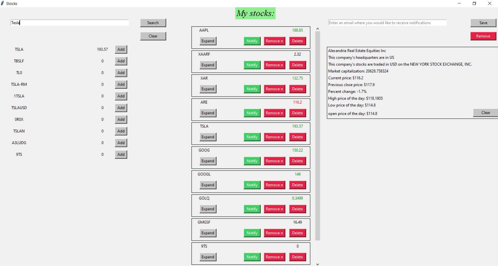

# Stock Price Tracker

Stock Price Tracker is a Python application designed to help users track stock prices and receive notifications based on price changes. The application utilizes the free version of the Finnhub financial API to fetch stock data and provides a user-friendly interface for managing saved stocks and notification settings.

## Features
* Search Stocks: Users can search for stocks by their stock symbols using the search feature. The search results display the stock's quote, price, and an option to save the stock to their list.

* Saved Stocks: Users can view their saved stocks in a list format. Each stock entry displays the stock's quote, price, and options to manage notifications and delete the stock.

* Expand Stock Details: Users can expand a stock entry to view more details about the stock, including company information and additional price metrics.

* Notifications: Users can configure notifications for their saved stocks. Notifications can be set to trigger when a stock's price goes above or below a specified value. Notifications are sent via email to the user.

* Email Settings: Users can save or remove their email address for receiving notifications. This feature allows users to manage their notification preferences easily.

## Installation
### 1. Clone the repository:
```bash
git clone https://github.com/yourusername/stock-price-tracker.git
```
### 2. Install dependencies:
```bat
pip install -r requirements.txt
```
### 3. Run the application:
```bat
python main.py
```
## Usage
1. Search for Stocks: Enter a stock symbol in the search field and click "Search" to find stocks. Click "Add" to save a stock to your list.

2. Manage Saved Stocks: View your saved stocks in the list. Expand a stock to view more details or click "Notify" to configure notifications.

3. Configure Notifications: Click "Notify" on a saved stock to open the notification popup. Enter a positive number and select a notification type (above or below). Click "Done" to save your notification settings.

4. Manage Email Settings: Enter your email address in the email field and click "Save" to receive notifications. Click "Remove" to stop receiving notifications.

## Technologies Used
* Python
* Tkinter (GUI)
* Finnhub API
* SMTP (for email notifications)
* JSON
* Threading
## Contributing
Contributions are welcome! Please fork the repository and submit a pull request with your changes.
## Note
* If a stock price is 0, it likely means that the stock is not traded on the US market. In such cases, the free version of the Finnhub API does not provide its price.
* This project is completely for educational purposes and not to be used for real trading!
## GUI Preview
